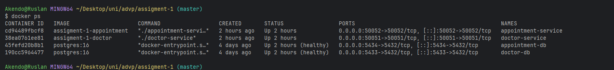
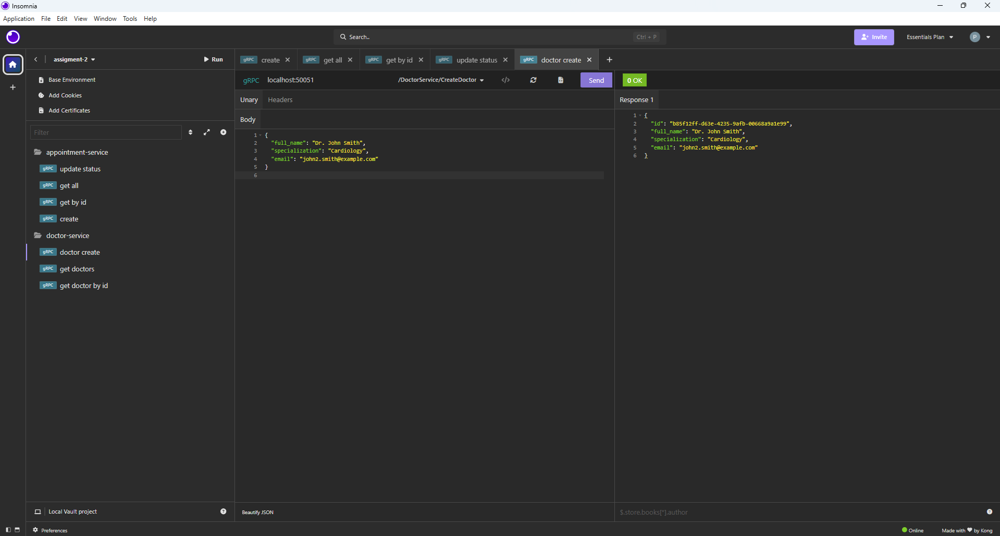
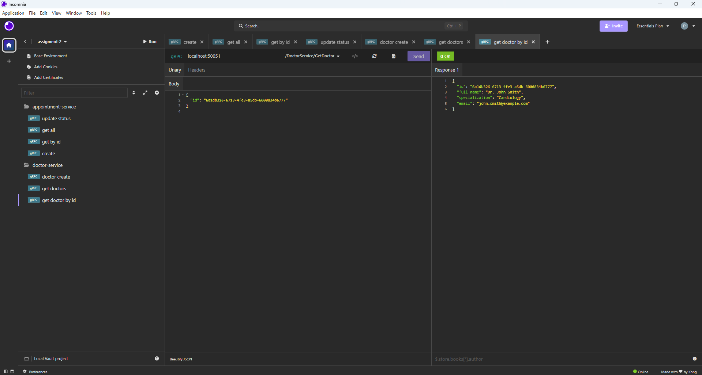
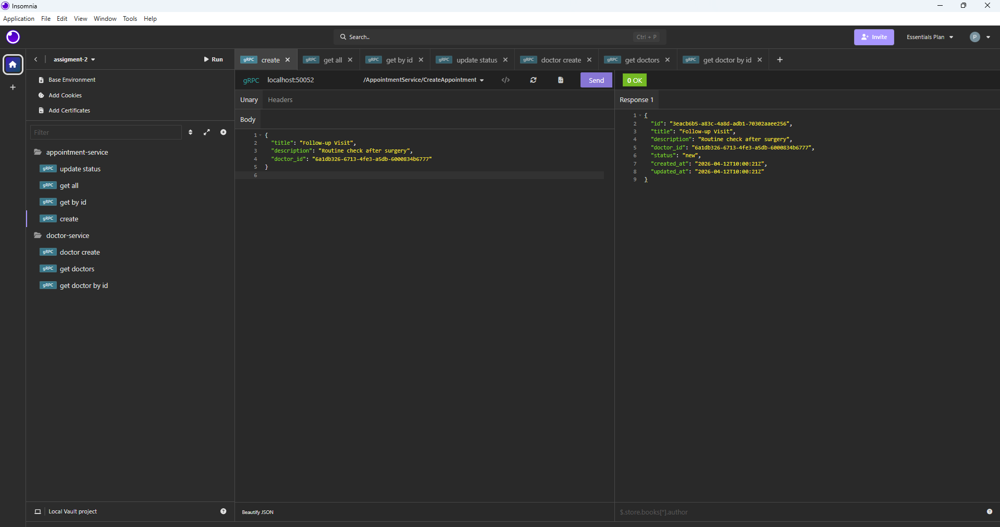
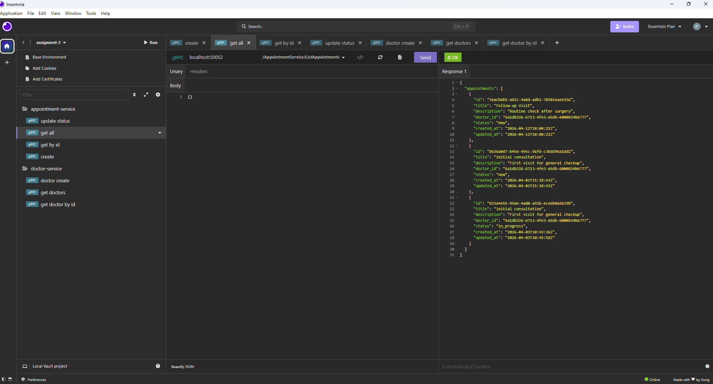
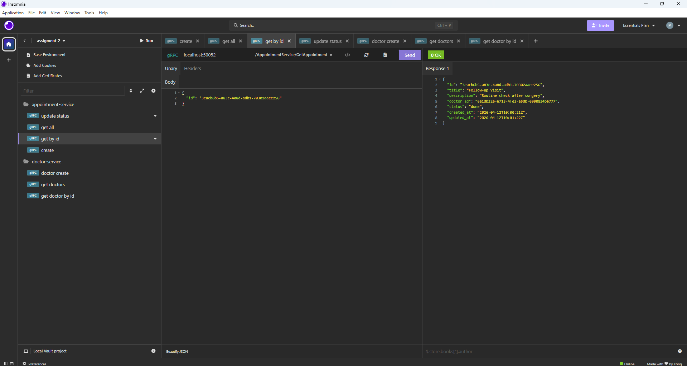
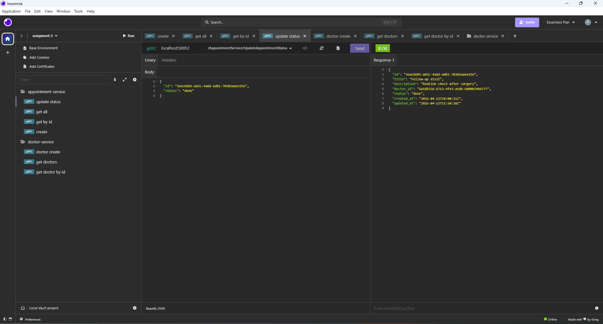

This project contains two Go microservices migrated from REST to gRPC:

- `doctor` service
- `appointment` service

Each service keeps its own database and Clean Architecture layers. The domain models, repository logic, and use-case rules from Assignment 1 are preserved. Only the transport layer and inter-service communication were migrated to gRPC.

## Project Overview

This repository includes:

- `.proto` contracts for both services
- generated Go stubs committed to the repository
- gRPC server implementations for both services
- a gRPC client adapter in `appointment` for calling `doctor`

## Architecture

- `internal/model` contains domain entities and rules
- `internal/repository` contains repository interfaces
- `internal/repository/postgres` contains PostgreSQL implementations
- `internal/usecase` contains application business logic
- `internal/transport/grpc` contains thin gRPC handlers
- `internal/app` wires dependencies and starts the gRPC server

The `appointment` service does not call the `doctor` service directly from the use case. Instead:

- the use case depends on a `DoctorGateway` interface
- the gRPC client adapter implements that interface
- the adapter is injected from the application layer

## Project Structure

```text
assigment-1/
├── doctor/
│   ├── cmd/doctor/
│   ├── internal/
│   │   ├── app/
│   │   ├── model/
│   │   ├── repository/
│   │   ├── transport/grpc/
│   │   └── usecase/
│   └── proto/
│       ├── doctor.proto
│       ├── doctor.pb.go
│       └── doctor_grpc.pb.go
├── appointment/
│   ├── cmd/appointment/
│   ├── internal/
│   │   ├── app/
│   │   ├── client/
    │   ├── errors/
│   │   ├── model/
│   │   ├── repository/
│   │   ├── transport/grpc/
│   │   └── usecase/
│   └── proto/
│       ├── appointment.proto
│       ├── appointment.pb.go
│       └── appointment_grpc.pb.go
├── utils/
├── docker-compose.yml
├── go.mod
└── README.md
```

## Proto Contracts

Proto files:

- `doctor/proto/doctor.proto`
- `appointment/proto/appointment.proto`

Generated stubs committed to the repository:

- `doctor/proto/doctor.pb.go`
- `doctor/proto/doctor_grpc.pb.go`
- `appointment/proto/appointment.pb.go`
- `appointment/proto/appointment_grpc.pb.go`

### Doctor Service RPCs

- `CreateDoctor(CreateDoctorRequest) returns (DoctorResponse)`
- `GetDoctor(GetDoctorRequest) returns (DoctorResponse)`
- `ListDoctors(ListDoctorsRequest) returns (ListDoctorsResponse)`

Business rules:

- `full_name` is required
- `email` is required
- `email` must be unique

### Appointment Service RPCs

- `CreateAppointment(CreateAppointmentRequest) returns (AppointmentResponse)`
- `GetAppointment(GetAppointmentRequest) returns (AppointmentResponse)`
- `ListAppointments(ListAppointmentsRequest) returns (ListAppointmentsResponse)`
- `UpdateAppointmentStatus(UpdateStatusRequest) returns (AppointmentResponse)`

Business rules:

- `title` is required
- `doctor_id` is required
- doctor must exist in the `doctor` service
- valid statuses are `new`, `in_progress`, `done`
- transition `done -> new` is forbidden

## How to Regenerate Proto Stubs

### 1. Install `protoc`

Official documentation:

- [Protocol Buffers installation](https://protobuf.dev/installation/)

On Windows one option is:

```powershell
winget install protobuf
```

Then reopen the terminal and verify:

```powershell
protoc --version
```

### 2. Install Go plugins

```powershell
go install google.golang.org/protobuf/cmd/protoc-gen-go@latest
go install google.golang.org/grpc/cmd/protoc-gen-go-grpc@latest
```

Make sure your Go bin directory is in `PATH`, then verify:

```powershell
protoc-gen-go --version
protoc-gen-go-grpc --version
```

### 3. Regenerate code

Run from the repository root:

```powershell
protoc --go_out=. --go_opt=paths=source_relative --go-grpc_out=. --go-grpc_opt=paths=source_relative doctor/proto/doctor.proto
protoc --go_out=. --go_opt=paths=source_relative --go-grpc_out=. --go-grpc_opt=paths=source_relative appointment/proto/appointment.proto
```

## Running the Services

### Option 1. Run with Docker Compose

```powershell
docker compose up --build
```

This starts:

- PostgreSQL for `doctor` on host port `5433`
- PostgreSQL for `appointment` on host port `5434`
- `doctor` gRPC server on `localhost:50051`
- `appointment` gRPC server on `localhost:50052`

## Environment Variables

### Doctor service

- `DB_HOST`
- `DB_PORT`
- `DB_NAME`
- `DB_USER`
- `DB_PASSWORD`

### Appointment service

- `DB_HOST`
- `DB_PORT`
- `DB_NAME`
- `DB_USER`
- `DB_PASSWORD`
- `DOCTOR_SERVICE_ADDR`

Example:

```text
DOCTOR_SERVICE_ADDR=localhost:50051
```

## Service Responsibilities and Data Ownership

### Doctor service

Owns:

- doctor records
- doctor lookup
- doctor creation rules

Database table:

- `doctors`

### Appointment service

Owns:

- appointment records
- appointment status transitions
- validation that an appointment references an existing doctor

Database table:

- `appointments`

The `appointment` service does not own doctor data. It only validates doctor existence by calling the `doctor` service over gRPC.

## Inter-Service Communication

When `CreateAppointment` is called:

1. the gRPC handler validates request fields
2. the use case calls the injected `DoctorGateway`
3. the gRPC client adapter calls `DoctorService.GetDoctor`
4. if the doctor exists, the appointment is created
5. if the doctor does not exist, the appointment service returns `FailedPrecondition`
6. if the doctor service is unreachable, the appointment service returns `Unavailable`

This keeps the dependency direction clean:

- use case depends on an interface
- client adapter depends on generated gRPC client code
- delivery layer depends on generated gRPC server code

## gRPC Error Handling Strategy

All failures are translated into standard gRPC status codes using `google.golang.org/grpc/status` and `google.golang.org/grpc/codes`.

### Doctor service

- missing `full_name` or `email` -> `InvalidArgument`
- duplicate email -> `AlreadyExists`
- doctor not found -> `NotFound`

### Appointment service

- missing `title`, `doctor_id`, `id`, or `status` -> `InvalidArgument`
- remote doctor does not exist -> `FailedPrecondition`
- doctor service unreachable or timeout -> `Unavailable`
- appointment not found -> `NotFound`
- invalid status or forbidden transition `done -> new` -> `InvalidArgument`

## Failure Scenario

If the `doctor` service is unavailable:

- the `appointment` service cannot validate `doctor_id`
- the gRPC client adapter detects `Unavailable` or timeout errors
- the adapter returns an application error to the use case
- the appointment gRPC handler returns `codes.Unavailable`

In a production system, this is where additional resilience patterns could be added:

- deadlines and timeouts
- retries for transient failures
- circuit breakers
- structured logging and tracing

## Testing with Insomnia

This project was tested using Insomnia gRPC requests.

### Doctor service

Server:

```text
localhost:50051
```

Proto file:

```text
doctor/proto/doctor.proto
```

Methods tested:

- `doctor.DoctorService/CreateDoctor`
- `doctor.DoctorService/GetDoctor`
- `doctor.DoctorService/ListDoctors`

### Appointment service

Server:

```text
localhost:50052
```

Proto file:

```text
appointment/proto/appointment.proto
```

Methods tested:

- `appointment.AppointmentService/CreateAppointment`
- `appointment.AppointmentService/GetAppointment`
- `appointment.AppointmentService/ListAppointments`
- `appointment.AppointmentService/UpdateAppointmentStatus`

### Scenarios tested

- create doctor
- get doctor by id
- list doctors
- create appointment with valid doctor
- get appointment by id
- list appointments
- update appointment status to `in_progress`
- update appointment status to `done`
- create appointment with missing fields
- create appointment with non-existing doctor
- invalid status update
- forbidden transition `done -> new`
- doctor service unavailable

## REST vs gRPC Trade-offs

### 1. Contract definition

REST often relies on informal documentation and JSON payload conventions, while gRPC uses explicit `.proto` contracts that generate server and client code automatically.

### 2. Performance and payload format

REST typically uses JSON over HTTP, which is human-readable but larger. gRPC uses Protocol Buffers, which are smaller and faster to serialize.

### 3. Client generation

With REST, clients are often handwritten or generated from OpenAPI separately. With gRPC, strongly typed client and server stubs are generated directly from the same `.proto` contract.

### 4. Browser friendliness

REST is easier to test directly in browsers and simple HTTP tools. gRPC usually requires tools such as Insomnia, Postman gRPC, or `grpcurl`.

### 5. When to choose which

I would choose gRPC for internal microservice communication where strong contracts, speed, and typed clients matter. I would choose REST for public-facing APIs where browser compatibility, simplicity, and human-readable payloads are more important.

## Screenshots 









## References

- [gRPC documentation](https://grpc.io/docs/)
- [gRPC Go quick start](https://grpc.io/docs/languages/go/quickstart/)
- [Protocol Buffers installation](https://protobuf.dev/installation/)
